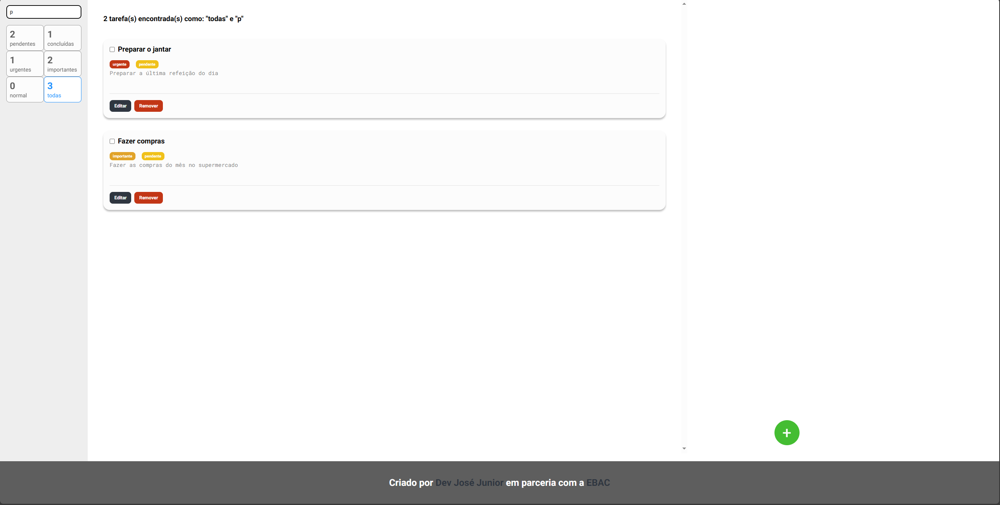
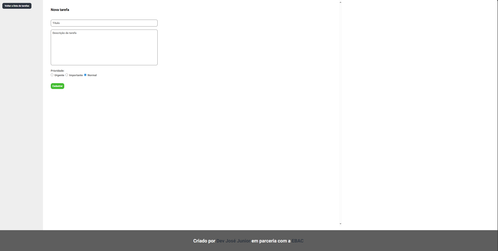

# 📝 Minhas Tarefas — App de Gestão com React + Redux

Projeto criado como parte do curso de Engenharia Front-End da [EBAC](https://ebaconline.com.br), e posteriormente **melhorado por mim** com foco em **responsividade, acessibilidade e experiência de usuário**.

[`v2` no GitHub](https://github.com/jose-junior1/minhas-tarefas/tree/v2)

---

## 🚀 Funcionalidades

- ✅   Cadastro e edição de tarefas
- ✅   Filtros por status e prioridade
- ✅   Responsivo para dispositivos móveis (até 768px)
- ✅   Menu hambúrguer com animação
- ✅   **Cursores personalizados** para interação visual mais intuitiva
- ✅   Scroll isolado na lista de tarefas
- ✅   Acessibilidade com `aria-label`
- ✅   Animações com `styled-components`
- ✅   Navegação entre páginas com React Router

---

## 🛠️ Tecnologias Utilizadas

- **React**
- **TypeScript**
- **Redux** (gerenciamento de estado global)
- **React Router DOM**
- **styled-components**


---

## 🎨 Detalhes de Design

- 📱 Layout mobile-first
- 🧭 Menu lateral com botão hamburguer
- 🖱️ **Cursores personalizados** para botões e elementos clicáveis
- 🎯 Separação clara entre tarefas pendentes, em andamento e concluídas
- 🔒 Acessibilidade e usabilidade como prioridade

---

## 📱 Responsividade

O layout foi adaptado para funcionar bem em **dispositivos móveis**, com:
- Menu lateral deslizante
- Botão hambúrguer com animação de abertura
- Scroll apenas nas tarefas, com altura de tela fixa
- Componentes otimizados para touch e telas menores

---

## 📷 Imagens do Projeto

<p align="center">
  
  &nbsp;&nbsp;
  
</p>

---

## 📦 Instalação e Uso Local

```bash
git clone https://github.com/jose-junior1/minhas-tarefas.git
cd minhas-tarefas
git checkout v2
npm install
npm start
```
---

## 🧠 Sobre o Desenvolvimento

Durante o curso da EBAC, o projeto foi construído com base no aprendizado prático de React, Redux e estilização moderna.
Na branch v2, adicionei melhorias próprias, incluindo:

- Boas práticas de UI/UX
- Cursores personalizados com cursor: url() e fallback
- Responsividade completa
- Animações e transições suaves
- Separação de componentes por responsabilidade

---

## 🔗 Acesse o projeto

> 🔗 Acesse online: _[Em breve com Vercel](#)_

---

## 📚 Licença

Projeto com fins educacionais.

